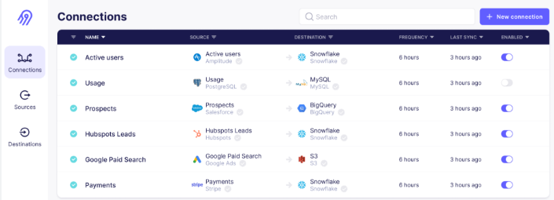
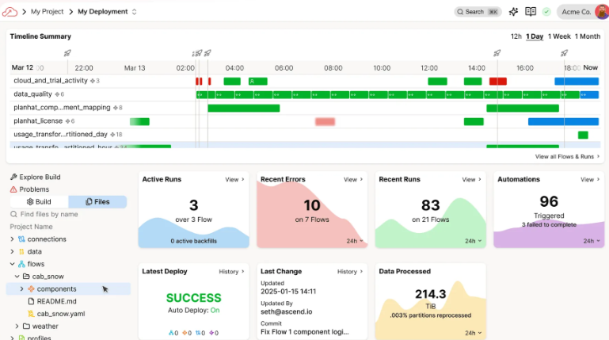
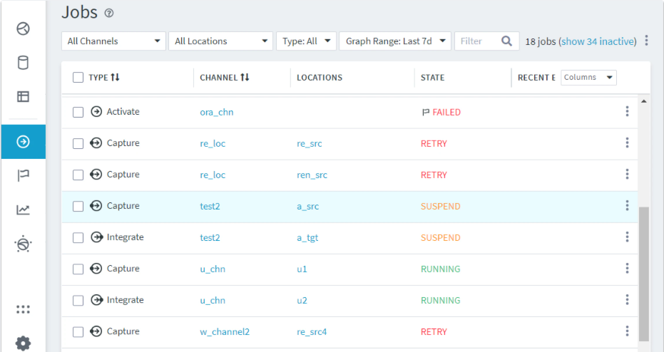
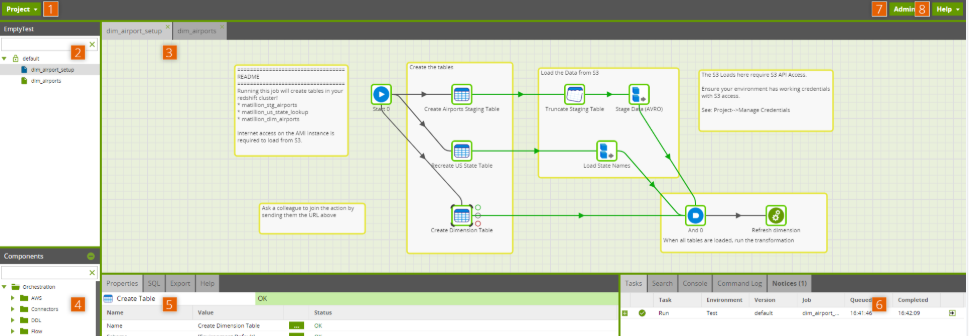
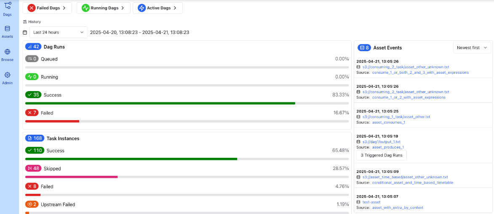

### Report on Open Source Data Pipeline Tools
Tools covered include; Airbyte, Fivetran, Master Matillion, Ascend.io and Airflow  
### Introduction
Detailed tools analysis report for selected data integration tools, providing an in-depth review of each tool. This report covers four open-source ETL tools and explanations on their performance uses, pros and cons. This is finalized with a brief summary of each tool explaining its best use cases for a specific project/requirement. 

### Table of contents
1. Airbyte
2. Ascend.io
3. Fivetran
4. Master-Matillion
5. Airflow

### 1. Airbyte
Airbyte is a data ingestion tool which does this by using **connectors**. Airbyte has hundreds of source and destination connectors like MySQL, S3, Snowflake etc. Each connector runs in its own Docker container making it modular and extensible. Airbyte can be deployed in two ways. The options are:
- Self-hosted
- Airbyte Cloud

#### Performance uses
This tool performs well depending upon the situation. These situations include:
- **Centralised data from multiple sources.**  
This tool works well when it comes to requiring access to many different sources of data such as databases, apps, IoT etc. Due to its wide variety of connection options and simplicity of setting up the connections, this tool is ideal for simple data ingestion.
- **Control over infrastructure.**  
When it comes to using cloud, compliance and security protocols soon become a big concern. However, as Airbyte can be self-hosted, this takes away the pressures of making sure your system is safe and compliant with regulations. On the contrary, not using cloud will reduce scalability and most importantly make it harder for cross-collaboration.
- **Build or customize connectors.**  
As mentioned earlier, Airbyte has many different connection options to ingest data. This tool allows you to build and customize connectors which makes it very flexible depending on your data stream. This is great for projects which don’t necessarily need to be using traditional streams like S3. Also, the connector development kit is very user-friendly and straightforward to interact with.
- **ETL workflows.**  
If your project is more focused on pushing transformations downstream and not necessarily inside the ETL pipeline, then Airbyte is more suited for that. As this is a data ingestion tool, when it comes to automating the ETL process, this is not the best tool but is great for data ingestion and flexible data connectors. This tool excels at moving large volumes of data between various sources and destinations like warehouses, lakes and databases.

#### Positives
- **Large Connector Library.** As mentioned earlier, Airbyte allows a variety of different connections which makes it very flexible if you need data from multiple streams. On top of the large connection library, you can make your own connections and even modify them to your specific needs.
- **Containerization.** Isolated connectors reduce dependency conflicts as some connections may require configurations which another connection doesn’t. This means isolating the process will reduce conflicts.
- **Self-hosting.** Airbyte can be easily self-hosted which is great for smaller projects which don’t require mass amounts of computational resources and have the ability to host their system locally. This is perfect for teams which are looking to cut costs on their development process.

#### Negatives
- **Still maturing.** Airbyte is not a fully developed leading tool and is still in a long development stage. Some connectors are still marked as beta or alpha as they are not fully secure and still lack stability. This is a big concern if sensitive data is to be streamed with these connectors.
- **Maintenance overhead.** If your process is self-hosted, then you are required to fully maintain everything. This includes things such as updates, configurations, hardware and monitoring. This is not ideal for teams that are looking to automate their ETL process and minimize maintenance overhead.
- **Docker.** When it comes to running Airbyte connectors on Docker (containers), it becomes very resource heavy. As this allocates computing power to the connectors alongside Docker running. It is not required to be run on Docker, but it requires some form of containerization where allocations of computing power can be conserved by the connectors.
- **EL.** Airbyte is really more of an ELT tool rather than an ETL tool. Transformations cannot be done inside Airbyte which requires another tool to manage this process. This is not ideal for a fully automated ETL pipeline on one system as it would require the use of another tool which can be counterproductive if you run into configuration issues.

#### Summary
Airbyte is fantastic due to its variety of connections and even having the ability to build custom connections. It offers a simple UI and connection builder kit which makes it easy for users to interact and manage their processes. On top of that, Airbyte has the ability to self-host your pipeline which can be extremely cost-efficient. However, there are quite a few drawbacks when it comes to using Airbyte in the traditional ETL pipeline way. Airbyte is more of an EL or ELT tool as transformations are to be completed from another tool e.g. Airflow. This tool would be best suited for a small team looking to keep their system hosted locally and not necessarily focused on the scalability of their system yet.

---

### 2. Ascend.io
Ascend.io is an agentic data engineering/automation platform. It aims to unify multiple processes such as extraction, transformation, loading, scheduling and monitoring into a single platform. Ascend also provides AI capabilities which can help drive production levels.

#### Performance uses
This tool performs well depending upon the situation. These situations include:
- **Complex data engineering / automation.** If your system requires multiple connections and needs to perform transformations, scheduling and monitoring, then Ascend.io has the capability to do this in a single platform.
- **Reduce overhead.** Linking to the previous point, if your system is pretty complex, then when it comes to maintenance, it can be a big deal. However, Ascend has the ability to manage the computational aspect and simplify maintenance solutions like scheduling.
- **Production time.** Teams that want faster time to production: Ascend claims many users get up to 7× faster pipeline build/deployment etc.

#### Positives
- **High automation.** Allows the full ETL process to be conducted on the platform with features such as scheduling and monitoring. Assisted AI allows for even further automation as troubleshooting problems can be solved with routine AI help.
- **Observability.** Good ability to monitor, debug and troubleshoot the data process. You can also see data manipulations along with upstream and downstream effects. This is very good for teams dealing with complex data processing as mistakes are almost inevitable.
- **Flexibility.** Works with both low-code (visual) and full-code modes. This is great for integration with the stack, version control, parameters, Git workflow and environments.
- **Metadata Optimisations.** Follows and tracks data which avoids re-processing datasets which can be computationally heavy.

#### Negatives
- **Complexity.** As this platform provides some very powerful capabilities, it comes with a lot of learning curves in order to use it to its full potential. It can be overwhelming with the number of options and can become complex when it comes to scheduling and monitoring processes. Training and getting used to its abstractions (flows, components, parameters etc) can take time.
- **Cost.** Due to its extensive features, they come with a price. These can amount quickly if not monitored closely. There is also not much transparency about the pricing for the features, which can lead to unnoticed extra charges. Ultimately it can be more work to keep track of costs and usage than the actual process of the ETL.
- **AI features.** When it comes to AI, there is not 100% conviction that the agent will do the work correctly. This can be detrimental when it comes to important processes that require strong accuracy. It is important to take notes from AI but not to let it do the work.

#### Summary
Ascend is a great tool that will allow you to run an end-to-end ETL pipeline autonomously. However, that comes with a price tag for the platform and understanding how it works. It is a lot more complex in terms of setup and usage than other tools like Airbyte, but on the contrary, the features it provides are ultimately better. This is a great tool for teams that are looking to scale and manage their workflows all in one platform.

---

### 3. Fivetran
Fivetran is a fully managed ETL pipeline service that helps you move data from a variety of sources into a data warehouse/lake. It performs the EL process, and also the possibility to perform lightweight transformations, however, it is recommended to do advanced transformations with other tools.

#### Performance uses
- **Data warehouse/lake.** This tool is especially good if you are wanting to load your data into a warehouse or lake like Snowflake, Redshift etc. This is due to the connections already being in place for these types of sources.
- **Low maintenance.** This tool is ideal for autonomous data ingestion systems where it is not ideal to maintain loads of custom connectors or worry about schema drift. Infrastructure scaling is also something to be considered when using this tool as it is not the most optimal one.
- **Pre-built.** Pipelines are already mostly built in Fivetran which is great for teams that aren’t wanting to build from scratch or may not even have the expertise to do so. This makes development processes more efficient.

#### Positives
- **Easy setup.** Provides a fairly simple UI which allows users to kickstart the setup process quickly. This also refers to the use of the connections which are simple and allow you to get data flowing from many common sources into your warehouse without a huge engineering effort.
- **Managed infrastructure.** Fivetran handles connector maintenance, scaling, schema changes and error recovery. This reduces development overhead and allows for effective development and processing.
- **Schema change.** A massive positive to Fivetran is its graceful handling of schema changes. This can be a massive decision point for teams as schema is at the foundation of most projects, so when this changes, so does everything else.

#### Negatives
- **Cost.** Fivetran’s pricing has changed recently to a per-connector basis for monthly active rows (MARs). This means that with many connectors in place, prices can start to accumulate very quickly and costs may increase unexpectedly. It also makes it harder to manage the pricing as things like returning data from APIs can be added to the bill if more rows are added.
- **Transformations.** Although there are options for some lightweight transformations, if your process requires heavy transformations, then this will have to be processed with another tool which can still link. However, this can be time-consuming and become complex with configurations.
- **Processing time.** While Fivetran does support frequent syncs, it is not the most optimal when it comes to real-time data processing as some connectors can take up to five minutes. It is more focused on batch or micro-batch processing.

#### Summary
Fivetran is a great tool when you want a reliable managed data ingestion platform with a variety of existing connectors, low maintenance overhead and are not too concerned about heavy transformations. On the contrary, it is not ideal for projects that require heavy transformations, don’t have a strong budget as large amounts of data processing cost a lot with Fivetran. Most importantly, if you are working with real-time data, then Fivetran will not be the most optimal service due to its processing time.

---

### 4. Master-matillion
Matillion is a cloud-native data ingestion platform designed to help teams build ETL pipelines whilst being able to orchestrate these processes into cloud data warehouses e.g. Snowflake, Redshift, BigQuery etc. It provides a wide range of connectors and has a UI interface.

#### Performance uses
- **Warehouse/lake use.** This tool is appropriate for infrastructures which are using data warehouses/lakes to load their data into. This is where you can utilize the transformation power and Matillion does not offer heavy transformations.
- **UI.** Matillion is great for projects which involve both technical and non-technical users as it provides options for low-code and more advanced transformations in warehouse/lake services.
- **Many sources.** If the project has multiple sources from which you need to extract data, transform it and load it into a single or few destinations, and want to manage/orchestrate in the same tool.

#### Positives
- **Ease of use.** Many find that Matillion is easier to get started with, especially for non-tech users thanks to a drag-and-drop interface. This is useful for understanding the relations in tasks and how the overall system architecture works.
- **Cloud-native.** Designed for cloud environments, one can scale the infrastructure. This is great for teams who are looking to upscale or suddenly have a huge ingest of data that they need to process.
- **Orchestration.** Built-in functions allow users to oversee the processes and schedule tasks. This provides strong control over the pipeline and allows users to understand where potential errors may occur or have occurred.

#### Negatives
- **Cost.** As Matillion works by paying for compute power (VMs/cloud infrastructure) as well as for the transformations and number of jobs, costs can escalate with more data, more frequent jobs or even more complex transformations.
- **Cloud dependency.** If your destinations are not cloud or hybrid, then it’s possible to hit limitations. Also being cloud-native means all jobs will run in a cloud infrastructure which means you have to manage cloud costs, network connections etc.
- **Unflexible connections.** If your source systems are unusual or require complex pre-load transformations then you may end up writing custom connectors or doing workarounds which can become complicated and add toward development time.

#### Summary
Matillion offers a variety of features which are similar to most ETL tools. Having an interactive UI is a huge bonus as it allows non-tech users to visualize and understand the system. The biggest standout for Matillion is its cloud-native workflows which are great for projects/teams who are looking to possibly scale at any time. Even though these are all great features, it is important that this comes with a price tag and requires cloud cost monitoring which can stack up quickly if not kept under control.

---

### 5. Airflow
Apache Airflow is an open-source platform which allows you to orchestrate, monitor and schedule tasks. It does this by using an architecture called Directed Acyclic Graphs (DAGs) which are defined in Python scripts. This is essentially a linear flowchart of tasks to be completed that link together and cannot be looped.

#### Performance uses
- **Complex workflows.** If you are working with a complex workflow where some tasks may be dependent on the outcome from other tasks, then Airflow is optimized for that. This also includes branching which allows you to choose a path to run depending on the outcomes.
- **Batch workflows.** Airflow allows you to schedule tasks to run at specific times. This is great for projects which may need to be run at certain times of the day and can be fully automated to do so which leaves more time to work on other tasks.
- **Flexibility.** Multiple sources of data/tools can be used with Airflow. This includes custom scripts and advanced transformations which can be performed in the same platform and don’t require another tool.

#### Pros
- **Expressiveness.** Because workflows are made from code, you can write arbitrary logic and do conditional branching. Having this flexibility allows you to take your transformations to the next level. Things like dynamic workflows and parameterization become a lot easier to perform in Airflow as you’re not tied to what the UI allows.
- **Scalability.** Airflow can run distributed, horizontally scale workers and support many DAGs/tasks at a given time. Alterations to the executor allow you to assign more workers to tasks which allows for a more distributed workload.
- **General monitoring.** The UI, task logs and DAG overview give you visibility into how the pipeline is operating overall. This allows you to see areas where potential faults may have occurred and why they might have occurred.

#### Cons
- **Setup.** Production runs Airflow on Docker/containers instead of locally. This is not only a complex setup but can become complex with dependency, version and update clashes. This requires maintenance and monitoring of the Airflow infrastructure itself.
- **Time processing.** As above, Airflow is primarily for batch or scheduled tasks. Using it as a real-time streaming tool/event system usually means workarounds and having to integrate other tools.
- **Observing at scale.** When it comes to working with large complex pipelines, monitoring the infrastructure can become hard. Understanding interdependencies, diagnosing failures etc will start to become more complex and require a strong understanding of the underlying code.

#### Summary
Airflow is a strong, well-rounded, flexible and code-centric orchestration system especially when it comes to scheduling tasks. It does require a good understanding of Python and time-consuming setup, but when it is up and running and all configurations are matched, it is a great ETL tool. However, it is not ideal if you’re looking for a platform that can provide real-time processing or low-code interactions as this is primarily based around Python code.
